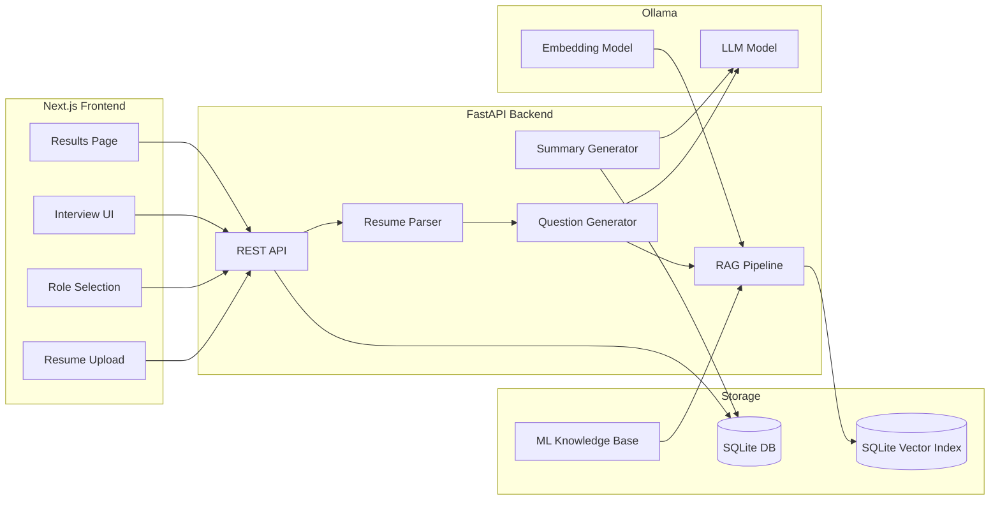

# AI Candidate Screening

An AI-powered, role-based candidate screening platform that uses **Retrieval-Augmented Generation (RAG)** to generate personalized technical interview questions from a candidate's resume and a role-specific ML knowledge base.

## Features

- Resume upload (PDF/TXT) with skill and technology extraction
- Role selection (ML Engineer, Data Scientist, ML Researcher, AI Engineer)
- Full RAG pipeline: chunking, embeddings, SQLite vector index retrieval
- Dynamic, context-aware question generation (Ollama LLM)
- Interview UI with per-question answer capture
- AI-generated interview summary with scores, strengths, weaknesses, and hiring recommendation
- SQLite persistence for sessions, Q&A, and reports

## Architecture



## Project Structure

```
ai-candidate-screening/
├── backend/
│   ├── app/
│   │   ├── api/routes.py          # REST endpoints
│   │   ├── services/
│   │   │   ├── rag/               # Chunking, ingestion, vector store
│   │   │   ├── resume_parser.py
│   │   │   ├── question_generator.py
│   │   │   └── summary_generator.py
│   │   ├── models/                # SQLAlchemy + Pydantic schemas
│   │   └── main.py
│   ├── scripts/ingest_knowledge.py
│   └── requirements.txt
├── frontend/
│   └── src/app/                   # Next.js pages
├── knowledge_base/
│   ├── documents/                 # Curated ML book knowledge (TXT)
│   └── sample_resumes/
└── README.md
```

## Prerequisites

- Python 3.11+
- Node.js 18+
- [Ollama](https://ollama.com/) (recommended)

### Ollama Models

```bash
ollama pull llama3.2
ollama pull nomic-embed-text
```

If Ollama is not running, the backend automatically falls back to **mock mode** for demos.

## Setup

### 1. Backend

```bash
cd backend
python -m venv .venv

# Windows
.venv\Scripts\activate

# macOS/Linux
source .venv/bin/activate

pip install -r requirements.txt
cp .env.example .env
```

Start the API:

```bash
uvicorn app.main:app --reload --port 8000
```

On first startup, the knowledge base is ingested into the vector index automatically.

Manual re-ingestion:

```bash
python scripts/ingest_knowledge.py
```

### 2. Frontend

```bash
cd frontend
npm install
cp .env.local.example .env.local
npm run dev
```

Open [http://localhost:3000](http://localhost:3000).

## API Endpoints

| Method | Endpoint | Description |
|--------|----------|-------------|
| GET | `/api/health` | Health + Ollama status |
| GET | `/api/roles` | List available roles |
| POST | `/api/sessions` | Upload resume, create session |
| POST | `/api/sessions/{id}/questions` | Generate RAG questions |
| POST | `/api/sessions/{id}/answers` | Submit answer |
| POST | `/api/sessions/{id}/complete` | Generate summary report |
| GET | `/api/sessions/{id}/summary` | Fetch report |

Interactive docs: [http://localhost:8000/docs](http://localhost:8000/docs)

## Knowledge Base

The repo includes curated TXT excerpts inspired by:

- *Machine Learning* — Tom Mitchell
- *The Hundred-Page Machine Learning Book*
- *Introduction to Machine Learning with Python*
- *Pattern Recognition and Machine Learning* (Bishop)

To add your own book content, place `.txt` or `.md` files in `knowledge_base/documents/` and run the ingestion script. Use descriptive filenames (e.g. `mitchell_*.txt`) for role-aware tagging.

## Demo Flow (for video)

1. Start backend and frontend (two terminals):

```bash
# Terminal 1
cd backend && .venv\Scripts\uvicorn app.main:app --reload --port 8000

# Terminal 2
cd frontend && npm run dev
```

2. Open [http://localhost:3000](http://localhost:3000)
3. Upload `knowledge_base/sample_resumes/ml_engineer_resume.txt`
4. Select **Machine Learning Engineer**
5. Review generated questions (resume skills influence topics/difficulty)
6. Answer all 5 questions
7. View results: overall score, strengths, weaknesses, topic scores, recommendation

Optional API smoke test:

```powershell
.\scripts\demo_flow.ps1
```

### Recording the demo video

Capture both terminals plus the browser. Show:
- Resume upload and parsed skills on the interview page
- RAG-generated questions with topic/difficulty tags
- Answer submission flow
- Final summary/insights screen

## Environment Variables

| Variable | Default | Description |
|----------|---------|-------------|
| `OLLAMA_BASE_URL` | `http://localhost:11434` | Ollama API URL |
| `OLLAMA_LLM_MODEL` | `llama3.2` | Generation model |
| `OLLAMA_EMBED_MODEL` | `nomic-embed-text` | Embedding model |
| `USE_MOCK_LLM` | `false` | Force mock responses |
| `QUESTIONS_PER_SESSION` | `5` | Questions per interview |

## License

MIT
